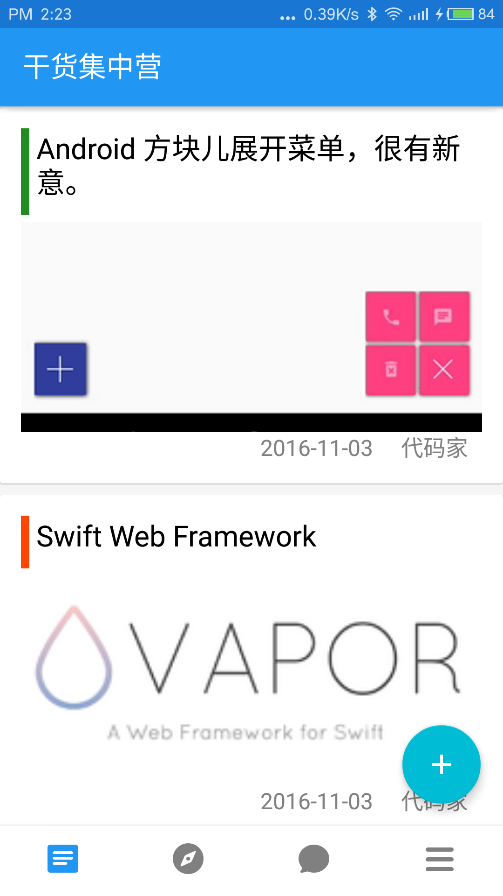
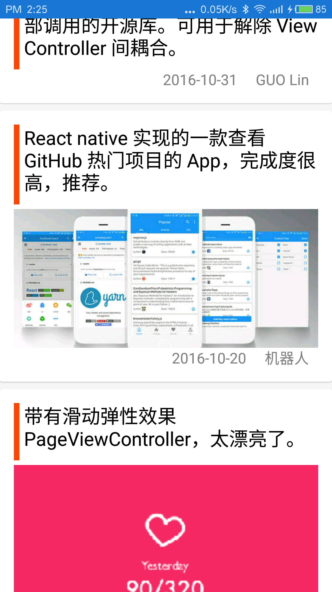
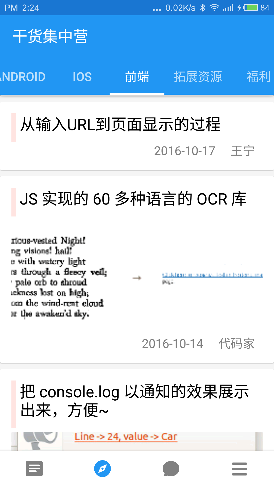
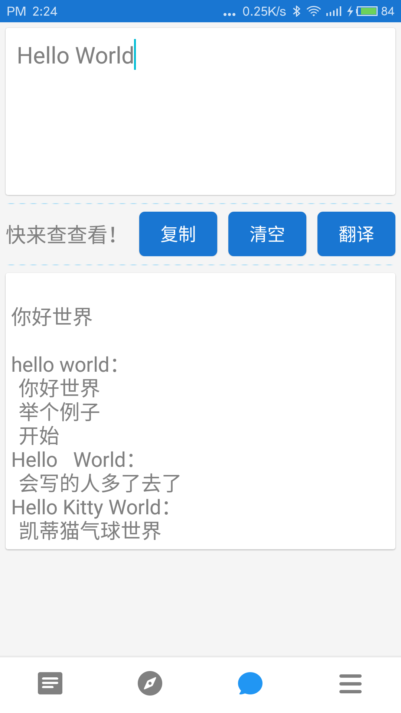
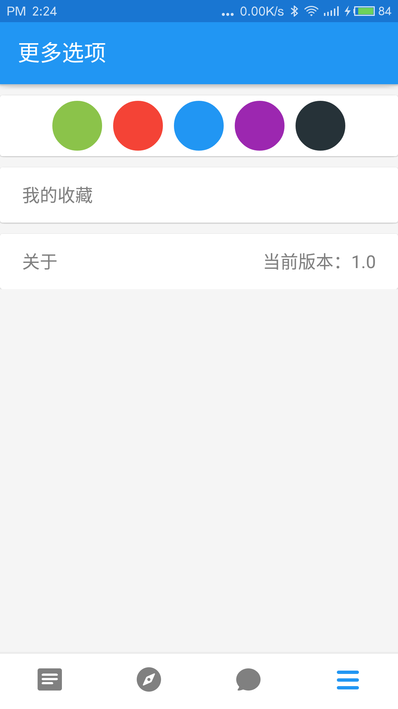

# gankioDemo
这是一个采用MVP+Retrofit+RxJava的实战项目！
使用了有道翻译的Api以及GankIo的Api，非常感谢开源人对初学者的帮助！

# 应用截图

# 简单介绍

1、网络层采用Retrofit加RxJava的模式，访问的接口在[这里-->http://gank.io/api](http://gank.io/api)。

2、图片加载使用的是Glide加载。

3、使用PhotoView进行大图展示，第一次使用感觉就像是另一个imageview那么好用。

4、WebView方面还在学习，使用的是android自带的WebView。

5、整个界面风格比较简约，提供主题切换，使用android的CoordinatorLayout结合ToolBar和FloatingActionButton，主题切换采用的是淡进淡出的效果。

6、使用RecycleView+CardView解析接口中获取的json数据并展示。

7、下拉刷新使用的是系统的SwipeRefreshLayout，上拉加载是以添加装饰的方式放在在Recycle的Adapter中。

8、翻译小工具，存在只是为了不让这个应用太单一。使用的接口是有道翻译的api，[戳我拿api](http://fanyi.youdao.com/openapi?path=data-mode)。

9、整个app使用MVP模式加上对recycleview的抽取，让逻辑神马的变得非常简单，根本没有初学时那么复杂了！很棒啊！

#其他
我的CSDN blog：[潜水的沙](http://blog.csdn.net/ahmclishihao)
